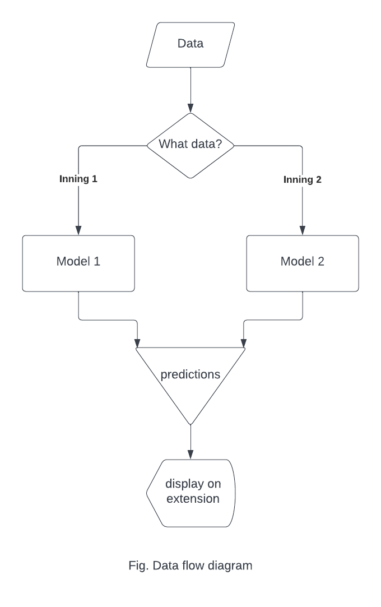

# IPL-WinProbability-Prediction

## Problem Statement
IPL Win prediction based on IPL historical data. [Click me for details](#problem_descpt)

## Dataset Used
IPL dataset of year 2008-2020 from kaggle.com. [See data here](https://www.kaggle.com/datasets/patrickb1912/ipl-complete-dataset-20082020)

## Outcome
1. Two separate ML models for 1st and 2nd inning to make more realistic predicions.
2. A chrome extension to display live predictions.
3. RESTful API using FLASK framework
 
## Data Flow Diagram

## Sequence Diagram

## Table of Content
- [Data Gathering | Cleaning | Feature Extraction](#gathering)
    - [Data Preparation Inning-1](#dataprep1)
    - [Data Preparation Inning-2](#dataprep2)
    - [Randomised Match ID based splitting](#datasplit)
- [Model Training](#mdl_trng)
- [Model Evaluation](#evaluate)
- [Plat and Isotonic Calibration](#calibration)
- [Flask API](#flask)
- [Data Scraping](#scraping)
- [System Pipeline](#pipeline)
- [Chrome Extension](#extension)
- [What I Learnt](#lessons)

<a name='problem_dscpt'>
<h2>Problem Description</h2>
</a>

In this project I have used IPL dataset of year 2008 - 2021 from Kaggle.com to train models for predicting the winning probability of teams in an IPL match. This project is an end-to-end application, I have created a chrome extension to display live winning probabilities of teams using separate models for each inning trained using separate dataset for each inning. I have applied *Plat* and *Isotonic* calibration on the model's probability values to calibrate them and make them more reliable. In order to get the live predictions, I created a dedicated Flask REST api to **GET** the data from website and **POST** the model predictions onto chrome extention.

<a name='gathering'>
<h2>Data Gathering | Cleaning | Feature Extraction</h2>
</a>

I took the raw dataset from [here](https://www.kaggle.com/datasets/patrickb1912/ipl-complete-dataset-20082020). The dataset consists of data of both innings. I prepared the data separately for each innings. Here is what I did for each inning:
- Cleaned it
- Did some feature extraction to make it ready for training.

<a name='dataprep1'>
<h3>Data Preparation Inning-1</h3>
</a>

Data preparation using inning-1 data, for this I used **`pandas`** library to explore the data and create new features from the existing features. Refer to the notebook below to see how its done.

[Notebook: data_prep_inn-1.ipynb](/Data%20Prep%20%26%20Model%20Building/notebooks/data_prep_inn-1.ipynb)

<a name='dataprep2'>
<h3>Data Preparation Inning-2</h3>
</a>

Data preparation using inning-2 data, for this I used **`pandas`** library to explore the data and create new features from the existing features. Refer to the notebook below to see how its done.

[Notebook: data_prep_inn-2.ipynb](/Data%20Prep%20%26%20Model%20Building/notebooks/data_prep_inn-2.ipynb)

<a name='datasplit'>
<h3>Randomised Match ID based splitting</h3>
</a>

For splitting my data for model training I did not use the standard **`train_test_split`** from **`sklearn`** library because using the standard train-test split there was great chance of **data leakage** and hence model trained using that data was highly overfit. Hence, I split the data manually by shuffling the match IDs. This lowers the risk of data leakage. Given below is the python script for the same.

[Script: data_splitter.py](/Data%20Prep%20%26%20Model%20Building/scripts/data_splitter.py)

<a name='mdl_trng'>
<h2>Model Training</h2>
</a>

- I trained 4 different models **Logistic Regression**, **Decision Tree**, **Random Forest**, **Gradient Boosting Decision Tree** and for each dataset (i.e., inning-1 and inning-2). 
- To avoid redundancy I created a single python script to train each model for each innings using command line arguments. All you need to do is, run this python script from command prompt and pass arguments like:
    - **`path`** of the data 
    - **`inn`** which is inning of the match
    - **`model_num`** which is the number of model we are currently training (this is for saving the model automatically after each run of the script).
    - **`model`** the name of the model we want to train (this is recognised by another script, which is **`model_dispatcher`**, it consists of the mapping of model name to its model). The script given below is the script for the automated training of models.

[Script: training.py](/Data%20Prep%20%26%20Model%20Building/scripts/training.py)

<a name='evaluate'>
<h2>Model Evaluation</h2>
</a>

In this notebook, I have the code for evaluating each model's performance trained and saved using the `training.py` script. The code consists of different evaluation metrics such as `Confusion Matrix`, `Precision Recall Curve`, `Receiver Operating Curve` and **a special plot to show the trend of accuracy with delivery of each over in the match** which gives a realistic performance evaluation for this particular application. See the notebook below.

[Notebook: model_evaluation.ipynb](/Data%20Prep%20%26%20Model%20Building/notebooks/model_evaluation.ipynb)

**Conclusion:** After evaluating each model seeing the performance metrics I chose the best model for each inning. For inning-1 data `Logistic Regression` model performed the best, while for inning-2 data `Gradient Boosting Classifier` model performed the best. In next step, I applied calibration on these models to give better predictions.

<a name='calibration'>
<h2>Plat and Isotonic Calibration</h2>
</a>

This is the very important task in the whole project. Since, our application relies on the probablities (We are predicting the probablity of win for the teams) it is very necessary to apply **calibration** on the probabilities given by our trained models. The probability needs to be more confident for our binary classification, if the class of a sample is positive then the probability of saying its positive should be high (more confident) so that we can rely upon that probability. The probabilites given by the models are not reliable, they are very less confident and hence there is need for **calibration** of the probabilities. See the image below to understand why calibration is important.

### Density Plot
The image shown below, shows the distribution of probabilities given by the model for trai and test data respectively. As we can see the densities at the ends (0 and 1) are not so high. Which means the model is less confident with the classification.

The curve shown in the image below is called **reliability curve**. The dotted line in the plot is the ideal behaviour for the model we expect and the blue curve is the result of our model which is not at all reliable. Hence we need to calibrate the probabilites. Calibration of probabilities will bring the curve close to the expected behavior.

### Isotonic and Plat Calibration
The plot shown below is the **reliablity curve** after we calibrate the probabilites. The green curve is for the **Isotonic Calibration** and the orange curve is for **Plat Calibration**. As we can see the Isotonic Calibrated probabilities give us more close to ideal behavior of the model we choose that for our final probabilities on which we can rely on.

### Density plot after calibration
Shown below is the density plot after calibration. We can see the density at the edges (0 and 1) is much high compared to the previous plot, which means we can rely more on these probabilites rather than the old ones as they are more confident.

Given below is the notebook for calibrating probabilities.

[Notebook: Calibration.ipynb](/Data%20Prep%20%26%20Model%20Building/notebooks/Calibration.ipynb)

<a name='flask'>
<h2>Flask API</h2>
</a>

I created a flask RESTful API to **`GET`** live cricket data from the *cricbuzz.com* website and **`POST`** the win probabilities on our chrome extension to show the realtime match prediction.

The code for the same is given in the script mentioned below.

[Script: main.py](/API/main.py)

<a name='scraping'>
<h2>Data Scraping</h2>
</a>

In order to get the live match data from *cricbuzz.com* website, **`BeautifulSoup`** library is used to get the data in a dictionary and later converted into dataframe for prediction. The following python script consists of the code for scraping data using BeautifulSoup.

[Script: beautifulSoup.py](/API/beautifulSoup.py)

<a name='pipeline'>
<h2>System Pipeline</h2>
</a>

Finally, the functional script which consists of the system pipeline code such that, if the inning-1 is going on model for inning-1 will be used and if the inning-2 is going on then the model for inning-2 will be used. The following python script consists of the code for pipeline.

[Script: functional.py](/API/functional.py)

<a name='extension'>
<h2>Chrome Extension</h2>
</a>

Lastly, I created a chrome extension using **JavaScript** to showing live winning probabilities for each team. Given below is the directory which consists of:
- `manifest.json` (a json file to create chrome extension), 
- `popup.html` (an extension popup to show the output), 
- `content.js`(to talk to our local host and get prediction data from models)

[Directory: /chrome-ext](/chrome-ext/)

<a name='lessons'>
<h2>What I Learnt</h2>
</a>

This project is an end-to-end Machine Learning based project and it was very challenging too. I have learnt a many skills while working on this project which are mentioned below.

### I have learnt following things from this project:
- **Exploratory Data Analysis**: I learnt how to explore data and understand the pattern within it. It is very necessary to explore the data before any ML task. We get to know what kind of data is given to us and hence accordingly use the appropriate tools to solve the problem. And also, it is very necessary for extracting features out of the data to make our model perform better.

- **Feature Extraction**: Most of the part of the project was just feature extraction. I extracted more important and more realistic features fromt the data using the existing ones. This task further improved my following skills:
    - **pandas.groupby**: I used the **`groupby`** method of **pandas** very extensively in the project to extract features.
    - **pandas.merge**: I also used **`merge`** method of **pandas** to merge the two dataset (the Ball by Ball data and Match data)
    - **series.agg**: Along with groupby method I have also learnt how to use **`agg`** method on series to extract data.

- **Random ID based splitting for better model performance**: I learnt, how random ID based splitting can be better than the standard *train_test_split* from sklearn. This method of splitting lowers the chances of overfitting the model to a great extent.

- **Plat calibration and Isotonic calibration**: I learnt why calibration is important when our application is relying on model probabilities rather than just class predictions. I learnt two methods of calibration Plat and Isotonic which makes a great difference if applied.

- **Data Scraping using BeautifulSoup**: I scraped the realtime data from the live matches from the *cricbuzz.com* website to get the predictions. And for this, I have used **BeautifulSoup** extensively in this project.

- **RESTful Flask API**: Since, there was no API available to get the match data I had to create my own RESTful API.

- **Creating a web extension**: I created a web extension to display the final result to the user and learnt how I can create a chrome web extension using *JavaScript*, *JSON* and *HTML*.

